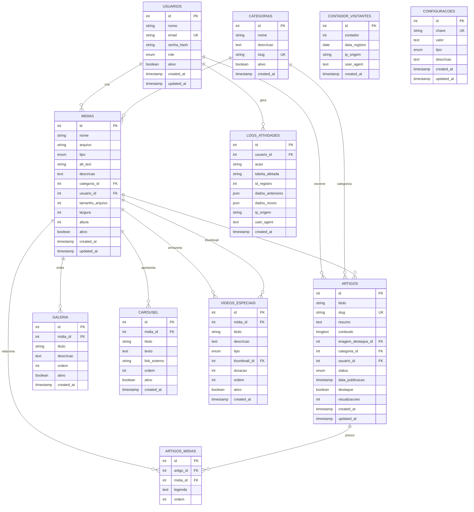

# Modelo Entidade Relacionamento - Museu Histórico de São José

## Diagrama ER

## Descrição das Entidades

### USUARIOS
Gerencia todos os usuários do sistema com diferentes níveis de acesso (admin, editor, viewer).

### CATEGORIAS  
Organiza o conteúdo por temas (História Local, Cultura, Documentos, etc.).

### MIDIAS
Entidade central que armazena todas as imagens e vídeos do sistema.

### GALERIA
Itens exibidos na galeria principal do site (substitui gallery.json).

### CAROUSEL
Slides do carrossel da página inicial (substitui carousel.json).

### ARTIGOS
Sistema completo de artigos/exposições com versionamento e status.

### ARTIGOS_MIDIAS
Relacionamento N:M entre artigos e mídias (galeria de cada artigo).

### VIDEOS_ESPECIAIS
Vídeos com propósitos específicos (intro, banner, educativo) - substitui videos.json.

### CONTADOR_VISITANTES
Sistema de analytics com controle por IP e data (substitui counter.json).

### CONFIGURACOES
Configurações gerais do sistema (títulos, emails, flags de funcionalidades).

### LOGS_ATIVIDADES
Auditoria completa de todas as ações dos usuários no sistema.

## Relacionamentos Principais

- **1:N** - Um usuário pode criar várias mídias, artigos e gerar múltiplos logs
- **1:N** - Uma categoria pode ter várias mídias e artigos
- **1:N** - Uma mídia pode aparecer em múltiplas galerias, carrossel e vídeos especiais
- **N:M** - Artigos podem ter múltiplas mídias associadas através da tabela de relacionamento
- **Autorreferência** - Mídias podem referenciar outras mídias (ex: thumbnail de vídeo)

## Benefícios da Estrutura

1. **Modularidade**: Cada funcionalidade em sua própria tabela
2. **Escalabilidade**: Relacionamentos bem definidos permitem crescimento
3. **Auditoria**: Sistema completo de logs e versionamento
4. **Flexibilidade**: Categorização e múltiplos tipos de conteúdo
5. **Performance**: Índices otimizados para consultas frequentes
