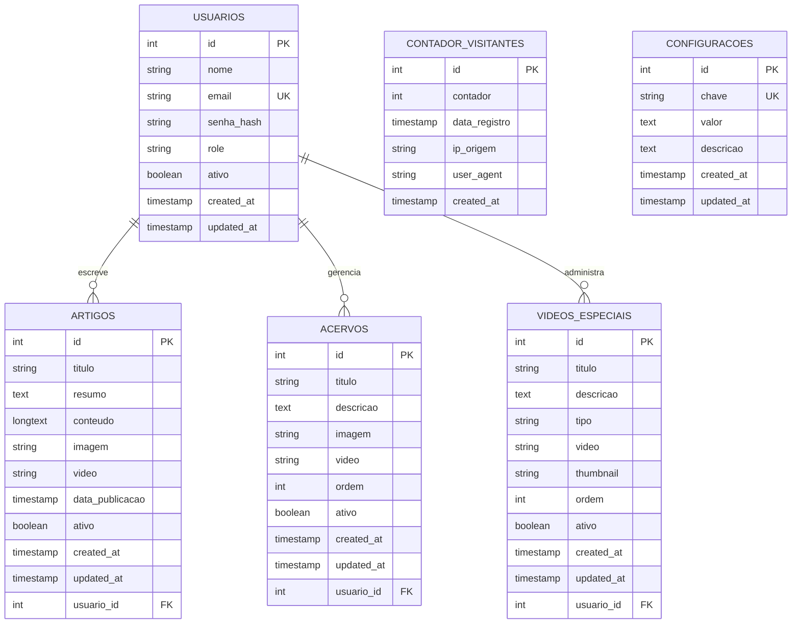

# Modelo Entidade Relacionamento - Museu Histórico de São José

## Diagrama ER

## Descrição das Entidades

### USUARIOS
Gerencia todos os usuários administradores do sistema que podem editar conteúdo.

### ARTIGOS
Sistema de artigos/exposições do museu com conteúdo completo.

### ACERVOS
Itens da galeria/acervo do museu (substitui gallery.json).

### VIDEOS_ESPECIAIS
Vídeos com propósitos específicos (intro, banner, educativo) - substitui videos.json.

### CONTADOR_VISITANTES
Sistema de analytics com controle por IP e data (substitui counter.json).

### CONFIGURACOES
Configurações gerais dinâmicas do sistema (títulos, emails, contatos, etc.).

## Relacionamentos Principais

- **1:N** - Um usuário pode criar várias artigos, acervos e vídeos especiais
- **Independente** - ContadorVisitante e Configuracao não têm relacionamentos
